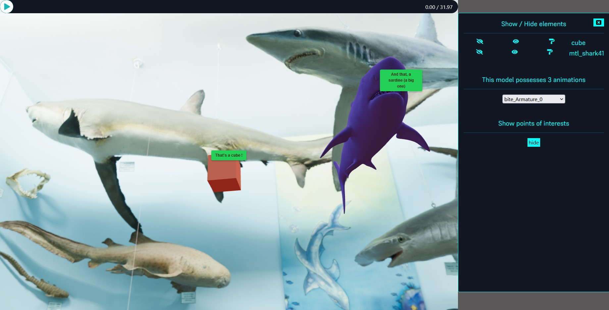

# 3D-player-for-web-browser
## Display 3D Models with JS the easy way

Uses Google's [model-viewer](https://modelviewer.dev/) library to display 3D models.
This library isn't made to be used like ThreeJS. The main purpose of model-viewer is to display 3D models. Interactivity isn't at the core of the lib, even if some options are possible (play/pause animation, play several animations, show/hide parts, ect)

## Features

- Display a 3D model
- Add a play / pause controller with the animation's timeline 
- Cycle through all the model's animations
- Show / Hide annotations
- Show / Hide parts individually
- Change parts' color (gadget)

## Tech

I use several libraries. Only one is mandatory, of course : [model-viewer](https://modelviewer.dev/)

- [model-viewer](https://modelviewer.dev/)
##### For lazyness
- Bootstrap 5.1
- Font-Awesome

## How to use

You can use the project as is or make your own with only ``` js/ModelPlayer.js```

Inside you page create an empty div, name it however you want but it has to have an ID
```html
<div id="player"></div>
```

And instantiate the player in you JS script

```js
let player = new ModelPlayer("player", "your3DModelID", "your GLB model path", "Your POI JSON file")

const buildedPlayer = player.buildPlayer();
```

Your player is working !
Now you can add an animation player and also a sidebar with several options
```js
const buildControls = () =>{
    /**
     * once the player is loaded and only once : builds its  controls and displays them
     * if you only want to display the 3D model, then do not proceed with this step
     */
    buildedPlayer.addEventListener('load', ()=>{
        player.buildControls(); //builds the animation player
        player.buildSidebar(); //build the sidebar options

        player.addTextureAndColor(); //only call this function if you use a blank model and want its parts colorized. The color is randomly generated. it also setRoughnessFactor to 1
    })
}

buildControls();
```

## Options
- It's possible to propose several models to the player :
```js
const models = [
    {
        src:'path to the first model.glb',
        poi:'path to the first model poi json's file',
    },
    {
        src:'path to the second model.glb',
        poi:null, //if no poi json then pass null or undefined
    }
]

let playerMulti = new ModelPlayer("crane", "lazy-load", models, null)
```

## Things to come ?
It's only early developpement so even if it's functionnal it'll evolve as to propose parameters like choosing which options one's want and stuff.
Also making it a React component will probably be done

## Preview

